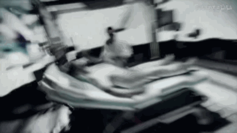
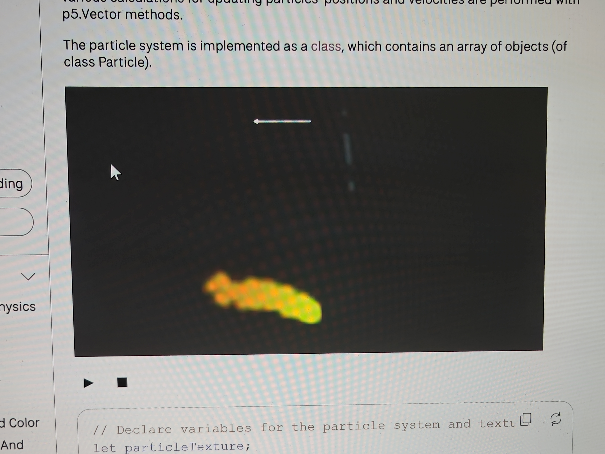
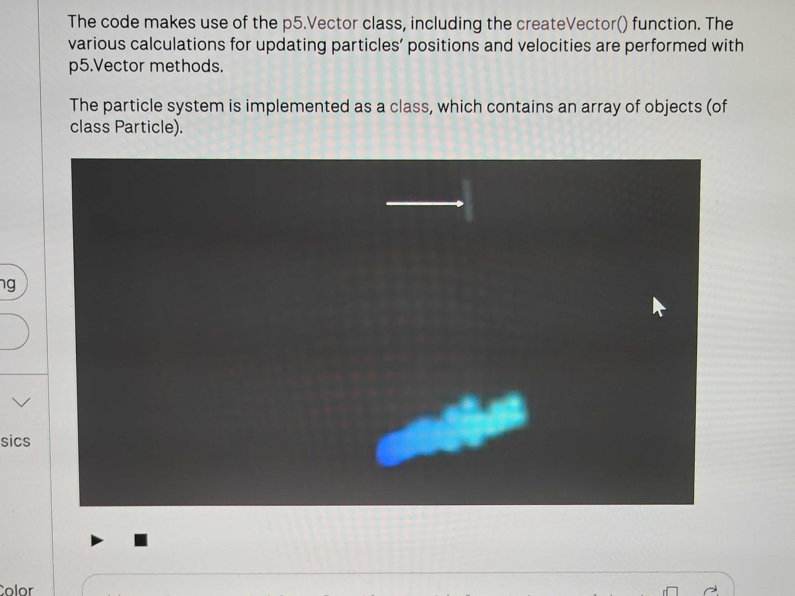
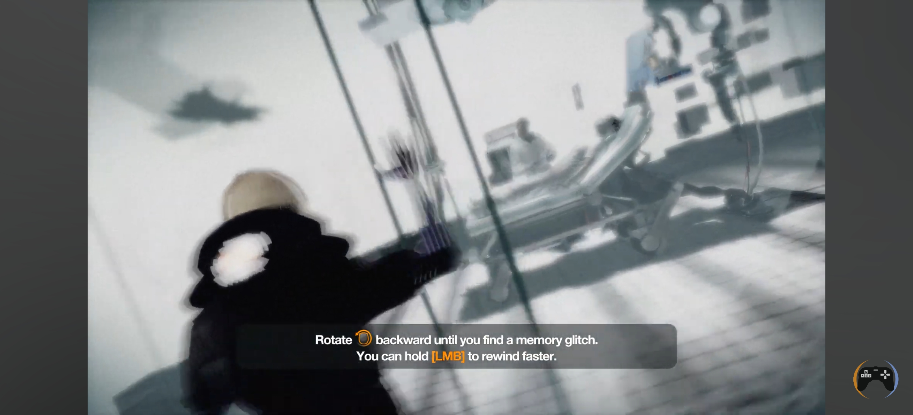
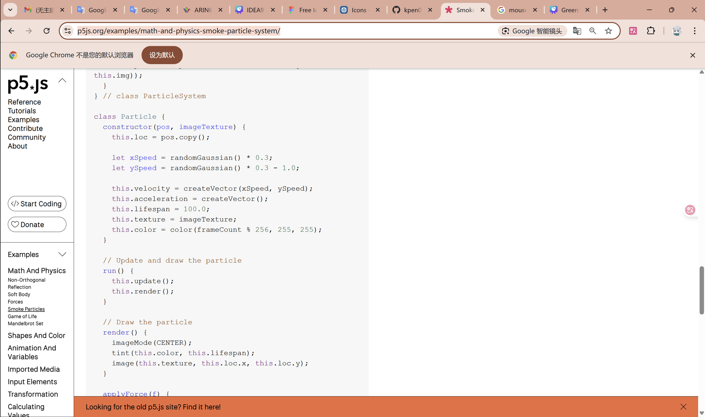

# kpen0858_9103_Tut03 Group G
# Creative coding major project: Individual part
## 1.How to interact  
This project supports mouse and keyboard interaction:
**Use mouse to drag the dot circle ring to rotate**   
Select any dot circle ring area on the edge of any circle, __press the mouse left button and rotate around the center of the circle__, and you can control the dot ring in the area to rotate with the direction of the mouse, with a real rotational inertia effect.  
**Use keyboard "E" key triggers global rotation**  
Users can __tap the E key on the keyboard__ to start the rotation effect of the global Dot circle ring.  
**Automatic Rotation Mechanism**  
When the rotation speed of __any dot interactive area reaches a certain threshold__, the dot point circle in that area will continue to rotate automatically and can be __stopped using the mouse or keyboard E__

## 2.Select the animation drive method:
I chose User Input as the core mechanism that drives my personal code interaction.

## 3.Image properties and their differences in animation
1. The animated part was the rotation angle of the DotRing component.
2. Include angleOffset(Controls rotation angle of each ring), angularVelocity (represents the speed and direction of rotation angular velocity), isDragging(Detect if the mouse is dragged), lastAngle(Record the angle corresponding to the last mouse position), isAutoRo(Check if it rotates automatically).
3. The user can use mouse to drag the dot ring to rotate it in the direction of the drag, while retaining angular velocity and inertia, that is, it can continue to rotate after releasing the mouse.
4. Press the E key on the keyboard to globally activate all dot rings to automatically rotate towards the current mouse direction.  
**Different**  
5. This personal part focuses more on the interaction between the mouse and dot point, with almost no deletion of group code, and almost all content is newly added.
6. Includes rotation effects that simulate acceleration and friction.
7. The user needs to use the mouse to manually simulate the spinning action to make any Dotpoint enter the automatic rotation mode.
8. Added a global rotation function by using key "E" to quickly display the personal work's effect, and also interrupt the automatic rotation, similar to the reset function

## 4.Inspiration
Refer to the Quiz 8: Design Research section below, inspired by the mouse rotation control in __"Remember Me"__ and the mouse control of fire direction and speed in the __Smoke Particles__ example in P5.js.

## 5.Technical Description
### I used the following technique to implement the rotation animation logic:
1. Use __atan2()__ function to calculate the angle of the mouse relative to the center of the circle.
2. Use __mousePressed()__ to Record the mouse press operation and initial angle figure.
3. Use __updateDotCircle()__ function to continuously update the angle difference to obtain the angular velocity.
4. Use __angleOffset__ to record and control the rotation angle offset of the entire graphic to create an animation effect.
5. Use __dr.angularVelocity *= 0.95;__ to simulating friction effect.
6. Use __angleDiff__ to record angle different of the mouse drag, the __angularVelocity__ is rotation angular velocity which to dynamically updated to achieve an acceleration effect driven by user operations.  
**Acknowledgement**  
7. I studied the code and referred to the official P5.js documentation. I also used AI such as Chatgpt and Gemini to assist in code understanding, including formula calculations.
8. Related Link: https://p5js.org/reference/p5/atan2/
9. Related Link: https://p5js.org/reference/p5/mousePressed/
10. Related Link: https://p5js.org/examples/math-and-physics-smoke-particle-system/
### Change description of the original group code:
1. Added new properties __angleOffset, angularVelocity, isDragging, lastAngle__ to DotRing class.
2. Added __Function updateDotCircle()__ to store and rewrite dotpoint drawing logic and add mouse dragging and automatic rotation control.
3. added __keyPressed(), mousePressed(), mouseReleased()__ is used to trigger global and manual rotation logic.

---

# Appendix: Quiz 8: Design Research
## Group image

## Part 1: Imaging Technique Inspiration
In the 2013 game __"Remember Me"__, player can __rotate the mouse or joystick to achieve the effect of memory replay__, and the speed of replay can be affected by the rotation speed. 
__'Wheels of fortune'__ which has a lot of circular and chain-like designs. Refer to the above operations to achieve an effect of repeatedly using the mouse to rotate and slide to start the circular rotated animation in the picture?
I think this will make the finished work more interactive and fun, like playing a game. 

## Part 2: Coding Technique Exploration
There is an example called Smoke Particles on the official website of P5.JS. Its smoke will swing with the displacement movement of the mouse on the x-axis, and can produce different effects according to the speed of different x-axis sliding.
So, I think in this example, it’s vector operation, mouse movement operation these coding techniques will effectively assist my conception.
For example, calculate the movement of the mouse x-axis and y-axis is to get the mouse rotation data, and use this to affect the rotation effect of the circular part in the picture.

## Link of Smoke Particles
[Smoke Particles]<https://p5js.org/examples/math-and-physics-smoke-particle-system/>

